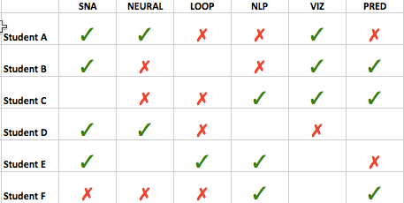

# ** Recommender Systems **

  

Recommender systems retrieve and filter data through content and similar profiles.  Usually used within the e-commerce domain (Amazon), they offer users recommendations for unknown, but possibly desirable products.  This technology is also used to suggest videos (YouTube), movies (NetFlix), even friends (Facebook).   The education domain may be the latest to apply recommender systems to support teaching and learning activities through enhanced information retrieval.  

Top areas – academic choices, e-learning
Top approaches – hybrid, collaborative filtering
Top evaluation/validation strategies – experiment, none
Top challenges – providing personalized recommendations, prediction accuracy

Here is an example of building a collaborative filter, an algorithm used to suggest content to a given user (filtering) by leveraging information about many users (collaboration). 

Recommendation Systems in Education: A Systematic Mapping Study 
Abdon Carrera Rivera, Mariela Tapia-Leon, Sergio Lujan-Mora
ICITS: International Conference on Information Theoretic Security Proceedings of the International Conference on Information Technology & Systems (ICITS 2018), Editors – Álvaro Rocha, Teresa Guarda, Conference proceedings ICITS 2018 
